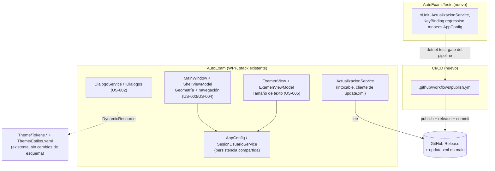

# 03 — Arquitectura técnica: Publicación automática + comodidad de interfaz

Diseño sobre `specs/02-tech-spec.md` (US-001 a US-005). Stack de aplicación es restricción dura
(.NET 8 / WPF / WPF-UI 4.3.0 / CommunityToolkit.Mvvm 8.4.0 / AutoUpdater.NET.Official 1.9.3 /
PdfPig) — no se evalúa alternativa para US-002 a US-005, solo se diseña *cómo* implementar
dentro de ese stack. La única decisión de stack real de esta iniciativa es la plataforma de
CI/CD para US-001 y el framework de tests (hoy inexistente en el repo).

## 1. Decisión de stack

### 1.1 Plataforma de CI/CD (US-001)

| Opción | Pros | Contras | Decisión |
|---|---|---|---|
| **GitHub Actions** | Nativo del repo (`MatiVillalba015/AutoExam` ya vive en GitHub); runner `windows-latest` disponible sin infra propia — obligatorio porque WPF no compila en Linux (`PresentationBuildTasks` es Windows-only); `GITHUB_TOKEN` ya scopeado al repo, sin secretos nuevos que administrar; trigger nativo `on: push`; visibilidad de fallos en la misma UI del repo (cumple NFR-02 sin herramienta extra) | Runner Windows consume minutos a tarifa 2x si el repo es privado y se excede el free tier (riesgo bajo: solo corre en subas de versión); requiere habilitar permisos de escritura a nivel repo (punto abierto, ver §4) | **Elegida** |
| Azure DevOps / Jenkins autohospedado | — | Segunda plataforma a mantener con cuenta/infra propia; requiere un PAT como secreto en un sistema externo; sin trigger nativo sobre el repo de GitHub; sin beneficio de costo/rendimiento frente a Actions para un pipeline de baja frecuencia (solo en subas de `<Version>`) | Descartada — no hay justificación costo/beneficio para introducir una segunda plataforma cuando el repo ya vive en GitHub |

Justificación en 5 líneas: el repo ya está en GitHub, así que Actions no agrega infraestructura
ni secretos nuevos más allá de habilitar un permiso; el único requisito duro (compilar WPF)
fuerza un runner Windows, que Actions ofrece de fábrica (`windows-latest`); la alternativa de
una plataforma externa solo suma superficie de ataque (PAT en un segundo sistema) sin ganar nada
a cambio para un pipeline que corre pocas veces por semana. Se prioriza costo operativo cero
sobre features que este pipeline no necesita.

### 1.2 Mecanismo de creación del Release dentro de Actions

`gh` CLI (preinstalado en runners `windows-latest`) vs. action de terceros
(`softprops/action-gh-release`). **Decisión: `gh release create`** — evita fijar una dependencia
de un tercero con un token que tiene permiso de escritura sobre `main`, y es el mismo concepto
que ya usa el desarrollador a mano (crear el Release desde la tag). Usa `gh release create
v{version} archivo.zip --generate-notes` (notas auto-generadas desde los commits; el
desarrollador las puede editar después, igual que hoy).

### 1.3 Framework de tests (no existe hoy en el repo)

No hay proyecto de test; `ActualizacionService.EsBucleDeActualizacion` / `AnotarIntento` /
`PaqueteDisponible` ya son `public static` con comentario explícito "para poder probarla sin
levantar ventanas" — diseñadas para testear, pero sin arnés. **Decisión: xUnit** sobre un
proyecto nuevo `AutoExam.Tests` (net8.0-windows, sin `UseWPF`, `ProjectReference` a
`AutoExam/AutoExam.csproj`) — estándar de facto en .NET 8, cero ceremonia, corre con `dotnet
test` en el mismo runner Windows del pipeline. Se agrega `AutoExam.sln` en la raíz (hoy no
existe) referenciando ambos proyectos. MSTest no aporta ventaja frente a xUnit para este alcance
y se descarta sin tabla aparte.

## 2. Componentes de la solución



Responsabilidades:

- **`.github/workflows/publish.yml`** (nuevo): único disparador de publicación. Reemplaza las
  dos invocaciones manuales de `publicar.ps1`; no modifica `publicar.ps1` (queda como fallback
  manual documentado, no se borra).
- **`AutoExam.Tests`** (nuevo): home de toda prueba automatizada del proyecto, incluida la que
  hoy falta para `ActualizacionService` (NFR-13/AC-T5) y la regresión de `ExamenView.xaml`
  (NFR-09/AC-T11).
- **`DialogoService`** (existente, cambia implementación): único punto de reemplazo de
  `MessageBox.Show` alcanzado por US-002.
- **`MainWindow` + `ShellViewModel`** (existentes, se extienden): geometría de ventana (US-003)
  y atajos de navegación global (US-004) — mismo dueño por compartir archivo (ver §5).
- **`ExamenView` + `ExamenViewModel`** (existentes, se extienden): tamaño de texto ajustable
  (US-005), sin tocar `Theme/Tokens.*` ni los `KeyBinding` ya existentes del `UserControl`.
- **`AppConfig` / `SesionUsuarioService`** (existente, se extiende): único mecanismo de
  persistencia de preferencias nuevas; no se introduce un segundo.
- **`ActualizacionService`**: no se toca. Solo se le agrega cobertura de test.

## 3. Decisiones de diseño que cierran ambigüedad de la tech-spec

- **`MessageBox.Show` de `App.xaml.cs` (`DispatcherUnhandledException`) y de
  `MainWindow.xaml.cs` (`Ventana_Loaded`, catch de `IniciarAsync`) quedan FUERA de alcance de
  US-002**, pese a la nota "a evaluar" del tech-spec: son redes de seguridad para fallas
  catastróficas/de arranque, donde el propio `DialogoService`, la composición de DI o los
  `ResourceDictionary` de tema podrían no estar en estado confiable todavía. Mantenerlos nativos
  es la opción más segura — ya hay precedente de esto en el propio `App.xaml.cs`. Un diálogo de
  error que depende del mismo pipeline que acaba de fallar no es una red de seguridad.
- **Multi-monitor para NFR-07 (US-003)**: se habilita `<UseWindowsForms>true</UseWindowsForms>`
  en `AutoExam.csproj` para usar `System.Windows.Forms.Screen.AllScreens` /
  `Screen.PrimaryScreen.WorkingArea`. Costo marginal real: `System.Windows.Forms.dll` **ya se
  publica hoy** en el output (confirmado en `bin/Release/.../win-x64/`), arrastrado
  transitivamente por `AutoUpdater.NET.Official` (su ventana de progreso es WinForms). No es una
  dependencia nueva, solo se habilita su uso directo en este proyecto.
- **US-005 no reescribe `TamEnunciado`/`TamCuerpo` de `Theme/Estilos.xaml`**: esos recursos son
  `StaticResource` compartidos por vistas fuera de Examen (confirmado: `TamCuerpo` se usa en al
  menos 3 estilos, no solo `OpcionExamen`). Cambiar su valor global afectaría toda la app.
  `ExamenViewModel` expone las propiedades de tamaño propias y `ExamenView.xaml` bindea
  `FontSize` directo a esas propiedades, no al recurso global (ver contrato en §3.5).

## 4. Contratos de interfaz entre componentes

### 4.1 US-001 — Pipeline (`.github/workflows/publish.yml`)

- Disparador: `on: push: branches: [main], paths-ignore: ['update.xml']` — evita que el propio
  commit del pipeline sobre `update.xml` vuelva a disparar el workflow. Refuerzo adicional:
  commit message `"update.xml: {version} [skip ci]"`.
- Job único, `runs-on: windows-latest`, orden de pasos (igual al de `publicar.ps1`, ahora en un
  solo flujo):
  1. Checkout.
  2. Leer `<Version>` de `AutoExam/AutoExam.csproj` y `<version>` de `update.xml` (ambos del
     mismo checkout); comparar como `[version]` de PowerShell.
  3. Si no es mayor → el job termina en éxito sin ejecutar nada más (cumple AC-T3/NFR-03; no es
     un fallo, es un no-op).
  4. `dotnet publish -c Release` (mismo `.csproj`, mismo `RuntimeIdentifier win-x64`).
  5. `dotnet test AutoExam.sln` — si `AutoExam.Tests` no existe todavía, este paso bloquea el
     pipeline (ver riesgo R-4); una vez exista, incluye la regresión de
     `ActualizacionService` (NFR-13/AC-T5).
  6. Verificar `FileVersion` del `.exe` publicado contra `<Version>` (misma lógica que
     `publicar.ps1`, líneas 124-135) — si no coincide, falla (AC-T4).
  7. Empaquetar `AutoExam-v{version}.zip` (un único `.exe` adentro).
  8. `gh release create v{version} AutoExam-v{version}.zip --generate-notes` (ver §1.2).
  9. HEAD (fallback GET Range 0-0) a la URL del asset recién publicado; si no da 200, falla sin
     tocar `update.xml` (AC-T2/NFR-04).
  10. Reescribir `update.xml` con la misma lógica regex que `publicar.ps1 -Publicar` (líneas
      88-91): solo `<version>`, URL de descarga, `<changelog>` (URL a la tag); `<mandatory>` no
      se toca.
  11. `git commit` + `git push` a `main`, solo `update.xml` (mismo alcance que hoy).
- Permisos requeridos en el YAML: `permissions: contents: write` a nivel de job (necesario para
  `gh release create` y para el push del paso 11).
- Salida en fallo: el run queda marcado como fallido en la pestaña Actions del repo, visible sin
  acceder a la PC del desarrollador — satisface NFR-02 sin tooling adicional.

### 4.2 US-002 — `IDialogos` (sin cambios de firma)

```csharp
bool Confirmar(string mensaje, string titulo = "AutoExam");
void Aviso(string titulo, string mensaje);
void Error(string titulo, string mensaje);
string? ElegirPdf();       // fuera de alcance, no se toca
void AbrirCarpeta(string ruta); // fuera de alcance, no se toca
```

Nueva implementación de `Confirmar`/`Aviso`/`Error` reemplaza el backend `MessageBox.Show` por
una ventana/`ContentDialog` propia de WPF-UI, consumiendo `DynamicResource` de `Theme/Tokens.*`
y estilos de `Theme/Estilos.xaml` (`Tarjeta`, tipografía `Txt*`) — cero color literal nuevo. El
punto de inyección en `App.xaml.cs` (línea 41, `new DialogoService()`) no cambia de forma.

### 4.3 US-003 — Geometría de ventana

Campos nuevos en `AppConfig` (`Models/PerfilUsuario.cs`), tipos y defaults fijados acá para que
el developer no tenga que decidirlos ni bloquear a nadie:

```csharp
public double VentanaAncho { get; set; } = -1;   // -1 = "sin guardar", usa default del XAML
public double VentanaAlto  { get; set; } = -1;
public double VentanaX     { get; set; } = -1;
public double VentanaY     { get; set; } = -1;
public System.Windows.WindowState VentanaEstado { get; set; } = System.Windows.WindowState.Normal;
```

Contrato de uso: `MainWindow.Ventana_Loaded` lee estos campos ANTES de que
`WindowStartupLocation` tenga efecto; si `VentanaAncho == -1` (nunca guardado) o el rectángulo
`(VentanaX, VentanaY, VentanaAncho, VentanaAlto)` no intersecta ningún `Screen.WorkingArea`
(monitor desconectado, ver §3), se ignora lo guardado y queda el comportamiento actual
(`CenterScreen`, `Width=1240 Height=820`) — cumple AC-T9/NFR-07. `MainWindow.Ventana_Closing`
escribe estos campos antes de `Vm.PuedeCerrar()`/`Vm.Cerrar()` (mismo punto donde hoy se decide
cerrar) y reutiliza `SesionUsuarioService.GuardarConfig()` ya existente.

### 4.4 US-004 — Navegación por teclado

Claves reales de `ShellViewModel.Paginas`, en orden fijo (confirmado en el código, no en la
spec): `"libros"`, `"nuevo"`, `"examen"`, `"historial"`, `"ajustes"`.

Atajos: `Ctrl+1` … `Ctrl+5` (índice 1 a 5 sobre ese orden). Elegidos con modificador `Ctrl` — no
`Alt` (reservado por WPF-UI/Windows para accesos de menú) ni tecla suelta (colisionaría con
`D1`-`D4`/`A`-`D`/`S` de `ExamenView.xaml` y con NFR-10). Se declaran como
`Window.InputBindings` en `MainWindow.xaml` (no en `ExamenView.xaml`), `Command="{Binding
IrACommand}"` (`ShellViewModel.IrA`, ya `[RelayCommand]`), `CommandParameter` = clave literal de
arriba. Por estar en un scope distinto (`Window` vs. `UserControl` de Examen) y no compartir
tecla, no interfieren con los `KeyBinding` de `ExamenView.xaml` por construcción — no solo por
orden de manejo de evento (satisface NFR-09 de forma estructural, no incidental).

Guardia obligatoria (defensa en profundidad para NFR-10, aunque `Ctrl+dígito` ya no colisiona
con tipeo normal): el comando debe no-operar si `Keyboard.FocusedElement` es un
`TextBoxBase`/`PasswordBox`/control editable.

### 4.5 US-005 — Tamaño de texto

Campo nuevo en `AppConfig`:

```csharp
public int TamanioTextoExamen { get; set; } = 2; // 0..4, 2 = tamaño actual (Normal)
```

`ExamenViewModel` expone `TamanioTextoPregunta`/`TamanioTextoOpciones` (double, en puntos),
calculadas por una tabla fija de 5 niveles (el developer define los valores exactos; 2 debe
mapear a los tamaños actuales — 17pt pregunta / 14pt opciones — para no romper el look por
defecto). `ExamenView.xaml` bindea `FontSize="{Binding TamanioTextoPregunta}"` /
`FontSize="{Binding TamanioTextoOpciones}"` en los `TextBlock`/`RadioButton` de pregunta y
opciones, **reemplazando** el `{DynamicResource TamEnunciado}` / `TamCuerpo}` actual solo ahí —
el resto de la app sigue usando el recurso global sin cambios.

## 5. Coordinación de módulos que comparten archivo

`Models/PerfilUsuario.cs` (clase `AppConfig`) recibe campos nuevos de dos módulos en paralelo
(US-003 y US-005, contratos en §4.3/§4.5 ya cerrados arriba para minimizar choque). Cada
developer agrega únicamente su bloque, al final de la clase, con el comentario de sección ya
existente como separador (`// Actualizaciones` es el precedente). Riesgo de conflicto de merge
bajo y ya cubierto en §6 (R-3).

`US-003` y `US-004` comparten `MainWindow.xaml` y `MainWindow.xaml.cs` — por eso este documento
les asigna el mismo módulo/desarrollador (`ventana-y-navegacion` en el roster) en vez de
paralelizarlos por separado: paralelizar dos instancias sobre los mismos dos archivos no bajaría
tiempo real, solo generaría un merge conflict garantizado.

## 6. Riesgos técnicos principales

1. **R-1 — Permisos del repo sin confirmar (bloqueante para el primer run real, no para
   diseño/código)**: falta validar en GitHub que `MatiVillalba015/AutoExam` tenga
   `Settings → Actions → General → Workflow permissions = Read and write permissions`, y que
   `main` no tenga branch protection que impida push directo del bot `github-actions[bot]`. Sin
   esto, los pasos 8 y 11 de §4.1 fallan aunque el YAML esté bien escrito. Acción: el usuario
   debe verificarlo/habilitarlo manualmente antes de que devops valide el pipeline en
   producción.
2. **R-2 — Auto-disparo del pipeline**: el commit de `update.xml` (paso 11) podría re-disparar
   `on: push`. Mitigado con `paths-ignore` + marca `[skip ci]` en el mensaje (§4.1); si alguno de
   los dos falla por mala configuración, no genera Releases falsos (NFR-03 lo protege) pero sí
   consume minutos de runner en bucle.
3. **R-3 — Conflicto de merge en `AppConfig`**: dos módulos (`ventana-y-navegacion`,
   `tamanio-texto-examen`) agregan campos al mismo archivo en paralelo. Mitigado por contrato
   cerrado en §4.3/§4.5 (nombres/tipos/orden ya definidos, no hay que negociarlos en code
   review) — el que mergea segundo resuelve un conflicto de una sola línea, trivial.
4. **R-4 — No existe hoy ningún proyecto de test**: NFR-13/AC-T5 asumen tests que "ya cubren"
   `ActualizacionService`, pero no existen. `AutoExam.Tests` y sus primeros casos son
   prerequisito real antes de que el paso 5 de §4.1 tenga sentido — si `test-dev-actualizacion`
   se atrasa, devops debe arrancar el pipeline sin el gate de test y agregarlo después, no
   bloquear US-001 completo por esto.
5. **R-5 — Runner Windows obligatorio**: WPF no compila en Linux, así que no hay downgrade
   posible a un runner más barato. Costo esperado bajo (pipeline corre solo en subas de
   `<Version>`, no en cada push), pero a vigilar si el repo es privado y se acerca al límite de
   minutos gratis de GitHub.

## 7. Definition of Done

- Todo componente de §2 tiene owner en `specs/team-roster.yaml`: cumplido.
- Ningún developer queda bloqueado esperando a otro: campos de `AppConfig`, claves de
  navegación, atajos y el contrato de tamaño de texto quedan cerrados en §4, no delegados a
  decisión de implementación.
- Stack justificado, no solo enunciado: §1.

Sugerencia: una vez el usuario confirme R-1 (permisos del repo), devops puede correr el primer
push de prueba con una suba de `<Version>` de patch (ej. `1.0.2` → `1.0.3`) antes de considerar
US-001 cerrado.
