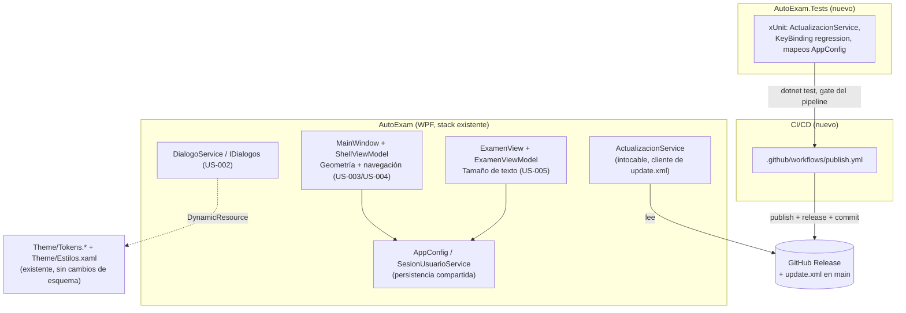
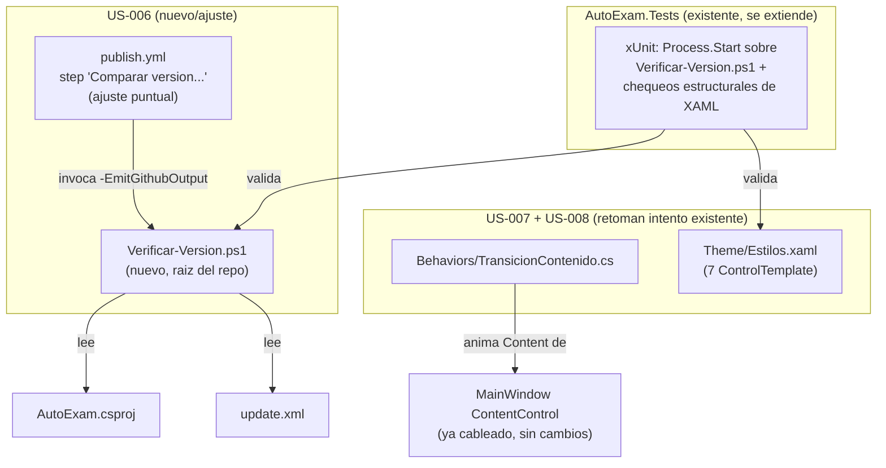
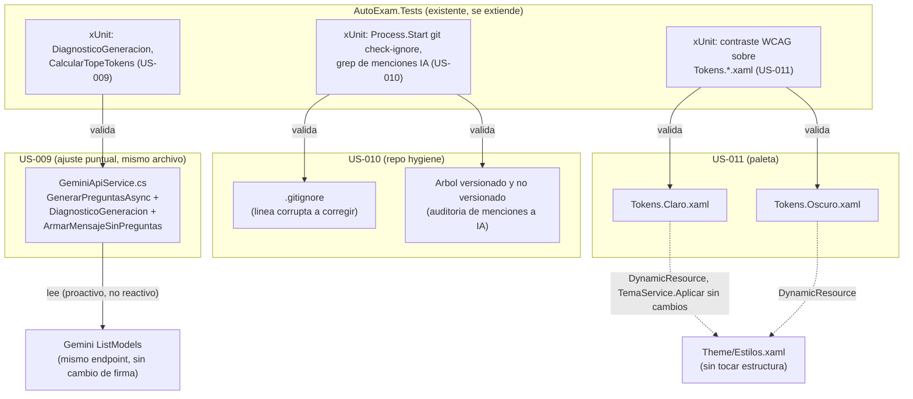

# 03 — Arquitectura técnica: Publicación automática + comodidad de interfaz

Diseño sobre `specs/02-tech-spec.md` (US-001 a US-005). Stack de aplicación es restricción dura
(.NET 8 / WPF / WPF-UI 4.3.0 / CommunityToolkit.Mvvm 8.4.0 / AutoUpdater.NET.Official 1.9.3 /
PdfPig) — no se evalúa alternativa para US-002 a US-005, solo se diseña *cómo* implementar
dentro de ese stack. La única decisión de stack real de esta iniciativa es la plataforma de
CI/CD para US-001 y el framework de tests (hoy inexistente en el repo).

## 1. Decisión de stack

### 1.1 Plataforma de CI/CD (US-001)

| Opción | Pros | Contras | Decisión |
|---|---|---|---|
| **GitHub Actions** | Nativo del repo (`MatiVillalba015/AutoExam` ya vive en GitHub); runner `windows-latest` disponible sin infra propia — obligatorio porque WPF no compila en Linux (`PresentationBuildTasks` es Windows-only); `GITHUB_TOKEN` ya scopeado al repo, sin secretos nuevos que administrar; trigger nativo `on: push`; visibilidad de fallos en la misma UI del repo (cumple NFR-02 sin herramienta extra) | Runner Windows consume minutos a tarifa 2x si el repo es privado y se excede el free tier (riesgo bajo: solo corre en subas de versión); requiere habilitar permisos de escritura a nivel repo (punto abierto, ver §4) | **Elegida** |
| Azure DevOps / Jenkins autohospedado | — | Segunda plataforma a mantener con cuenta/infra propia; requiere un PAT como secreto en un sistema externo; sin trigger nativo sobre el repo de GitHub; sin beneficio de costo/rendimiento frente a Actions para un pipeline de baja frecuencia (solo en subas de `<Version>`) | Descartada — no hay justificación costo/beneficio para introducir una segunda plataforma cuando el repo ya vive en GitHub |

Justificación en 5 líneas: el repo ya está en GitHub, así que Actions no agrega infraestructura
ni secretos nuevos más allá de habilitar un permiso; el único requisito duro (compilar WPF)
fuerza un runner Windows, que Actions ofrece de fábrica (`windows-latest`); la alternativa de
una plataforma externa solo suma superficie de ataque (PAT en un segundo sistema) sin ganar nada
a cambio para un pipeline que corre pocas veces por semana. Se prioriza costo operativo cero
sobre features que este pipeline no necesita.

### 1.2 Mecanismo de creación del Release dentro de Actions

`gh` CLI (preinstalado en runners `windows-latest`) vs. action de terceros
(`softprops/action-gh-release`). **Decisión: `gh release create`** — evita fijar una dependencia
de un tercero con un token que tiene permiso de escritura sobre `main`, y es el mismo concepto
que ya usa el desarrollador a mano (crear el Release desde la tag). Usa `gh release create
v{version} archivo.zip --generate-notes` (notas auto-generadas desde los commits; el
desarrollador las puede editar después, igual que hoy).

### 1.3 Framework de tests (no existe hoy en el repo)

No hay proyecto de test; `ActualizacionService.EsBucleDeActualizacion` / `AnotarIntento` /
`PaqueteDisponible` ya son `public static` con comentario explícito "para poder probarla sin
levantar ventanas" — diseñadas para testear, pero sin arnés. **Decisión: xUnit** sobre un
proyecto nuevo `AutoExam.Tests` (net8.0-windows, sin `UseWPF`, `ProjectReference` a
`AutoExam/AutoExam.csproj`) — estándar de facto en .NET 8, cero ceremonia, corre con `dotnet
test` en el mismo runner Windows del pipeline. Se agrega `AutoExam.sln` en la raíz (hoy no
existe) referenciando ambos proyectos. MSTest no aporta ventaja frente a xUnit para este alcance
y se descarta sin tabla aparte.

## 2. Componentes de la solución



Responsabilidades:

- **`.github/workflows/publish.yml`** (nuevo): único disparador de publicación. Reemplaza las
  dos invocaciones manuales de `publicar.ps1`; no modifica `publicar.ps1` (queda como fallback
  manual documentado, no se borra).
- **`AutoExam.Tests`** (nuevo): home de toda prueba automatizada del proyecto, incluida la que
  hoy falta para `ActualizacionService` (NFR-13/AC-T5) y la regresión de `ExamenView.xaml`
  (NFR-09/AC-T11).
- **`DialogoService`** (existente, cambia implementación): único punto de reemplazo de
  `MessageBox.Show` alcanzado por US-002.
- **`MainWindow` + `ShellViewModel`** (existentes, se extienden): geometría de ventana (US-003)
  y atajos de navegación global (US-004) — mismo dueño por compartir archivo (ver §5).
- **`ExamenView` + `ExamenViewModel`** (existentes, se extienden): tamaño de texto ajustable
  (US-005), sin tocar `Theme/Tokens.*` ni los `KeyBinding` ya existentes del `UserControl`.
- **`AppConfig` / `SesionUsuarioService`** (existente, se extiende): único mecanismo de
  persistencia de preferencias nuevas; no se introduce un segundo.
- **`ActualizacionService`**: no se toca. Solo se le agrega cobertura de test.

## 3. Decisiones de diseño que cierran ambigüedad de la tech-spec

- **`MessageBox.Show` de `App.xaml.cs` (`DispatcherUnhandledException`) y de
  `MainWindow.xaml.cs` (`Ventana_Loaded`, catch de `IniciarAsync`) quedan FUERA de alcance de
  US-002**, pese a la nota "a evaluar" del tech-spec: son redes de seguridad para fallas
  catastróficas/de arranque, donde el propio `DialogoService`, la composición de DI o los
  `ResourceDictionary` de tema podrían no estar en estado confiable todavía. Mantenerlos nativos
  es la opción más segura — ya hay precedente de esto en el propio `App.xaml.cs`. Un diálogo de
  error que depende del mismo pipeline que acaba de fallar no es una red de seguridad.
- **Multi-monitor para NFR-07 (US-003)**: se habilita `<UseWindowsForms>true</UseWindowsForms>`
  en `AutoExam.csproj` para usar `System.Windows.Forms.Screen.AllScreens` /
  `Screen.PrimaryScreen.WorkingArea`. Costo marginal real: `System.Windows.Forms.dll` **ya se
  publica hoy** en el output (confirmado en `bin/Release/.../win-x64/`), arrastrado
  transitivamente por `AutoUpdater.NET.Official` (su ventana de progreso es WinForms). No es una
  dependencia nueva, solo se habilita su uso directo en este proyecto.
- **US-005 no reescribe `TamEnunciado`/`TamCuerpo` de `Theme/Estilos.xaml`**: esos recursos son
  `StaticResource` compartidos por vistas fuera de Examen (confirmado: `TamCuerpo` se usa en al
  menos 3 estilos, no solo `OpcionExamen`). Cambiar su valor global afectaría toda la app.
  `ExamenViewModel` expone las propiedades de tamaño propias y `ExamenView.xaml` bindea
  `FontSize` directo a esas propiedades, no al recurso global (ver contrato en §3.5).

## 4. Contratos de interfaz entre componentes

### 4.1 US-001 — Pipeline (`.github/workflows/publish.yml`)

- Disparador: `on: push: branches: [main], paths-ignore: ['update.xml']` — evita que el propio
  commit del pipeline sobre `update.xml` vuelva a disparar el workflow. Refuerzo adicional:
  commit message `"update.xml: {version} [skip ci]"`.
- Job único, `runs-on: windows-latest`, orden de pasos (igual al de `publicar.ps1`, ahora en un
  solo flujo):
  1. Checkout.
  2. Leer `<Version>` de `AutoExam/AutoExam.csproj` y `<version>` de `update.xml` (ambos del
     mismo checkout); comparar como `[version]` de PowerShell.
  3. Si no es mayor → el job termina en éxito sin ejecutar nada más (cumple AC-T3/NFR-03; no es
     un fallo, es un no-op).
  4. `dotnet publish -c Release` (mismo `.csproj`, mismo `RuntimeIdentifier win-x64`).
  5. `dotnet test AutoExam.sln` — si `AutoExam.Tests` no existe todavía, este paso bloquea el
     pipeline (ver riesgo R-4); una vez exista, incluye la regresión de
     `ActualizacionService` (NFR-13/AC-T5).
  6. Verificar `FileVersion` del `.exe` publicado contra `<Version>` (misma lógica que
     `publicar.ps1`, líneas 124-135) — si no coincide, falla (AC-T4).
  7. Empaquetar `AutoExam-v{version}.zip` (un único `.exe` adentro).
  8. `gh release create v{version} AutoExam-v{version}.zip --generate-notes` (ver §1.2).
  9. HEAD (fallback GET Range 0-0) a la URL del asset recién publicado; si no da 200, falla sin
     tocar `update.xml` (AC-T2/NFR-04).
  10. Reescribir `update.xml` con la misma lógica regex que `publicar.ps1 -Publicar` (líneas
      88-91): solo `<version>`, URL de descarga, `<changelog>` (URL a la tag); `<mandatory>` no
      se toca.
  11. `git commit` + `git push` a `main`, solo `update.xml` (mismo alcance que hoy).
- Permisos requeridos en el YAML: `permissions: contents: write` a nivel de job (necesario para
  `gh release create` y para el push del paso 11).
- Salida en fallo: el run queda marcado como fallido en la pestaña Actions del repo, visible sin
  acceder a la PC del desarrollador — satisface NFR-02 sin tooling adicional.

### 4.2 US-002 — `IDialogos` (sin cambios de firma)

```csharp
bool Confirmar(string mensaje, string titulo = "AutoExam");
void Aviso(string titulo, string mensaje);
void Error(string titulo, string mensaje);
string? ElegirPdf();       // fuera de alcance, no se toca
void AbrirCarpeta(string ruta); // fuera de alcance, no se toca
```

Nueva implementación de `Confirmar`/`Aviso`/`Error` reemplaza el backend `MessageBox.Show` por
una ventana/`ContentDialog` propia de WPF-UI, consumiendo `DynamicResource` de `Theme/Tokens.*`
y estilos de `Theme/Estilos.xaml` (`Tarjeta`, tipografía `Txt*`) — cero color literal nuevo. El
punto de inyección en `App.xaml.cs` (línea 41, `new DialogoService()`) no cambia de forma.

### 4.3 US-003 — Geometría de ventana

Campos nuevos en `AppConfig` (`Models/PerfilUsuario.cs`), tipos y defaults fijados acá para que
el developer no tenga que decidirlos ni bloquear a nadie:

```csharp
public double VentanaAncho { get; set; } = -1;   // -1 = "sin guardar", usa default del XAML
public double VentanaAlto  { get; set; } = -1;
public double VentanaX     { get; set; } = -1;
public double VentanaY     { get; set; } = -1;
public System.Windows.WindowState VentanaEstado { get; set; } = System.Windows.WindowState.Normal;
```

Contrato de uso: `MainWindow.Ventana_Loaded` lee estos campos ANTES de que
`WindowStartupLocation` tenga efecto; si `VentanaAncho == -1` (nunca guardado) o el rectángulo
`(VentanaX, VentanaY, VentanaAncho, VentanaAlto)` no intersecta ningún `Screen.WorkingArea`
(monitor desconectado, ver §3), se ignora lo guardado y queda el comportamiento actual
(`CenterScreen`, `Width=1240 Height=820`) — cumple AC-T9/NFR-07. `MainWindow.Ventana_Closing`
escribe estos campos antes de `Vm.PuedeCerrar()`/`Vm.Cerrar()` (mismo punto donde hoy se decide
cerrar) y reutiliza `SesionUsuarioService.GuardarConfig()` ya existente.

### 4.4 US-004 — Navegación por teclado

Claves reales de `ShellViewModel.Paginas`, en orden fijo (confirmado en el código, no en la
spec): `"libros"`, `"nuevo"`, `"examen"`, `"historial"`, `"ajustes"`.

Atajos: `Ctrl+1` … `Ctrl+5` (índice 1 a 5 sobre ese orden). Elegidos con modificador `Ctrl` — no
`Alt` (reservado por WPF-UI/Windows para accesos de menú) ni tecla suelta (colisionaría con
`D1`-`D4`/`A`-`D`/`S` de `ExamenView.xaml` y con NFR-10). Se declaran como
`Window.InputBindings` en `MainWindow.xaml` (no en `ExamenView.xaml`), `Command="{Binding
IrACommand}"` (`ShellViewModel.IrA`, ya `[RelayCommand]`), `CommandParameter` = clave literal de
arriba. Por estar en un scope distinto (`Window` vs. `UserControl` de Examen) y no compartir
tecla, no interfieren con los `KeyBinding` de `ExamenView.xaml` por construcción — no solo por
orden de manejo de evento (satisface NFR-09 de forma estructural, no incidental).

Guardia obligatoria (defensa en profundidad para NFR-10, aunque `Ctrl+dígito` ya no colisiona
con tipeo normal): el comando debe no-operar si `Keyboard.FocusedElement` es un
`TextBoxBase`/`PasswordBox`/control editable.

### 4.5 US-005 — Tamaño de texto

Campo nuevo en `AppConfig`:

```csharp
public int TamanioTextoExamen { get; set; } = 2; // 0..4, 2 = tamaño actual (Normal)
```

`ExamenViewModel` expone `TamanioTextoPregunta`/`TamanioTextoOpciones` (double, en puntos),
calculadas por una tabla fija de 5 niveles (el developer define los valores exactos; 2 debe
mapear a los tamaños actuales — 17pt pregunta / 14pt opciones — para no romper el look por
defecto). `ExamenView.xaml` bindea `FontSize="{Binding TamanioTextoPregunta}"` /
`FontSize="{Binding TamanioTextoOpciones}"` en los `TextBlock`/`RadioButton` de pregunta y
opciones, **reemplazando** el `{DynamicResource TamEnunciado}` / `TamCuerpo}` actual solo ahí —
el resto de la app sigue usando el recurso global sin cambios.

## 5. Coordinación de módulos que comparten archivo

`Models/PerfilUsuario.cs` (clase `AppConfig`) recibe campos nuevos de dos módulos en paralelo
(US-003 y US-005, contratos en §4.3/§4.5 ya cerrados arriba para minimizar choque). Cada
developer agrega únicamente su bloque, al final de la clase, con el comentario de sección ya
existente como separador (`// Actualizaciones` es el precedente). Riesgo de conflicto de merge
bajo y ya cubierto en §6 (R-3).

`US-003` y `US-004` comparten `MainWindow.xaml` y `MainWindow.xaml.cs` — por eso este documento
les asigna el mismo módulo/desarrollador (`ventana-y-navegacion` en el roster) en vez de
paralelizarlos por separado: paralelizar dos instancias sobre los mismos dos archivos no bajaría
tiempo real, solo generaría un merge conflict garantizado.

## 6. Riesgos técnicos principales

1. **R-1 — Permisos del repo sin confirmar (bloqueante para el primer run real, no para
   diseño/código)**: falta validar en GitHub que `MatiVillalba015/AutoExam` tenga
   `Settings → Actions → General → Workflow permissions = Read and write permissions`, y que
   `main` no tenga branch protection que impida push directo del bot `github-actions[bot]`. Sin
   esto, los pasos 8 y 11 de §4.1 fallan aunque el YAML esté bien escrito. Acción: el usuario
   debe verificarlo/habilitarlo manualmente antes de que devops valide el pipeline en
   producción.
2. **R-2 — Auto-disparo del pipeline**: el commit de `update.xml` (paso 11) podría re-disparar
   `on: push`. Mitigado con `paths-ignore` + marca `[skip ci]` en el mensaje (§4.1); si alguno de
   los dos falla por mala configuración, no genera Releases falsos (NFR-03 lo protege) pero sí
   consume minutos de runner en bucle.
3. **R-3 — Conflicto de merge en `AppConfig`**: dos módulos (`ventana-y-navegacion`,
   `tamanio-texto-examen`) agregan campos al mismo archivo en paralelo. Mitigado por contrato
   cerrado en §4.3/§4.5 (nombres/tipos/orden ya definidos, no hay que negociarlos en code
   review) — el que mergea segundo resuelve un conflicto de una sola línea, trivial.
4. **R-4 — No existe hoy ningún proyecto de test**: NFR-13/AC-T5 asumen tests que "ya cubren"
   `ActualizacionService`, pero no existen. `AutoExam.Tests` y sus primeros casos son
   prerequisito real antes de que el paso 5 de §4.1 tenga sentido — si `test-dev-actualizacion`
   se atrasa, devops debe arrancar el pipeline sin el gate de test y agregarlo después, no
   bloquear US-001 completo por esto.
5. **R-5 — Runner Windows obligatorio**: WPF no compila en Linux, así que no hay downgrade
   posible a un runner más barato. Costo esperado bajo (pipeline corre solo en subas de
   `<Version>`, no en cada push), pero a vigilar si el repo es privado y se acerca al límite de
   minutos gratis de GitHub.

## 7. Definition of Done

- Todo componente de §2 tiene owner en `specs/team-roster.yaml`: cumplido.
- Ningún developer queda bloqueado esperando a otro: campos de `AppConfig`, claves de
  navegación, atajos y el contrato de tamaño de texto quedan cerrados en §4, no delegados a
  decisión de implementación.
- Stack justificado, no solo enunciado: §1.

Sugerencia: una vez el usuario confirme R-1 (permisos del repo), devops puede correr el primer
push de prueba con una suba de `<Version>` de patch (ej. `1.0.2` → `1.0.3`) antes de considerar
US-001 cerrado.

---

# Incremento 2 — Arquitectura: Disciplina de versión + animaciones de shell (US-006 a US-008)

Diseño sobre `specs/02-tech-spec.md` (sección "Incremento 2"). El stack de aplicación sigue
siendo restricción dura sin excepción (§1 de arriba, vigente sin cambios) — este incremento no
evalúa alternativas de stack de aplicación, solo cierra dos ambigüedades de implementación que el
tech-spec dejó explícitamente a criterio de arquitectura: (a) qué framework usar para testear
`Verificar-Version.ps1`, y (b) de qué forma concreta se comparte la lógica de comparación de
versión entre ese script y `publish.yml` (increment 1 §4.1, pasos 2-3). Para US-007 y US-008 el
tech-spec ya cerró el mecanismo técnico completo (`DependencyPropertyDescriptor`,
`Trigger.EnterActions`/`ExitActions` + `Storyboard`) — acá solo se define coordinación de trabajo
paralelo y contratos mínimos entre developer y test-developer.

## 1. Decisión de stack (incremento 2)

### 1.1 Framework de test para `Verificar-Version.ps1` (US-006)

| Opción | Pros | Contras | Decisión |
|---|---|---|---|
| Pester | Framework nativo de PowerShell, sintaxis `Describe`/`It` pensada para testear scripts | No está instalado por defecto en `pwsh` de `windows-latest` ni en la PC del desarrollador — requiere `Install-Module` (red, fricción de setup); introduce un segundo framework de test en un repo que hoy solo tiene xUnit, para cubrir un único script chico | Descartada |
| **xUnit + `Process.Start`** | `AutoExam.Tests` (xUnit) ya existe y ya es gate obligatorio del pipeline (increment 1 §4.1, paso 5); invocar el script como proceso hijo y verificar stdout + código de salida es un patrón estándar, sin reescribir el script como módulo; un solo framework de test en todo el repo | Aserciones sobre texto de consola son algo más frágiles que `Describe`/`It` nativo — mitigado exigiendo el formato exacto de mensaje ya cerrado en el tech-spec (§3.1 de abajo) | **Elegida** |

Justificación en 5 líneas: `AutoExam.Tests` ya existe y ya corre en CI, así que sumar Pester
crearía una segunda herramienta de test para un único script chico, con costo de instalación en
cada entorno (developer + runner) sin beneficio proporcional al tamaño del incremento. Invocar
el script como proceso hijo desde xUnit y verificar stdout/exit code cubre exactamente
AC-T15/16/17/18 sin ninguna dependencia nueva. Se prioriza consistencia de una sola herramienta
de test sobre expresividad de sintaxis para un caso de uso de este tamaño.

### 1.2 Mecanismo para no duplicar la lógica de comparación entre script local y `publish.yml`

El tech-spec (§"Decisiones de diseño", US-006) dejó dos caminos abiertos; se cierra acá:

| Opción | Pros | Contras | Decisión |
|---|---|---|---|
| **A — `Verificar-Version.ps1` parametrizado** (switch `-EmitGithubOutput`), invocado también desde el step de `publish.yml` | Un solo archivo con la comparación; el desarrollador que lo corre local ve exactamente el mismo código que corre en CI; cambia mínimamente `publish.yml` (una invocación reemplaza el bloque inline ya existente) | El script mezcla mensaje humano + emisión de outputs de CI tras un `if` — aceptable, es una sola rama condicional | **Elegida** |
| B — Función común en un tercer `.ps1` importado (dot-source) por ambos | Separación más "pura" de responsabilidades (función vs. wrapper CLI) | Un archivo más para mantener, un salto de indirección extra para un bloque de ~15 líneas — sobreingeniería para el tamaño del cambio | Descartada |

Justificación: menos archivos, mismo código corrido en los dos contextos (garantiza NFR-15 por
construcción, no por disciplina de mantener dos bloques sincronizados a mano), y el switch
opcional no complica la lectura del script para su caso de uso principal (correrlo a mano antes
de pushear).

## 2. Componentes de este incremento



Responsabilidades:

- **`Verificar-Version.ps1`** (nuevo, raíz del repo, junto a `publicar.ps1`): única fuente de
  verdad de "¿la versión subió respecto a la publicada?", consumida en modo interactivo (local,
  antes de pushear) y en modo CI (`-EmitGithubOutput`, desde `publish.yml`).
- **`publish.yml`** (existente, ajuste puntual): el step "Comparar version del proyecto vs.
  update.xml" deja de tener lógica propia inline y pasa a invocar el script de arriba.
- **`Behaviors/TransicionContenido.cs`** (existente, se completa): sin cambio de contrato
  público; ajuste opcional de duración configurable (§3.3).
- **`Theme/Estilos.xaml`** (existente, se extiende): los 7 `ControlTemplate` de US-008 ganan
  `Trigger.EnterActions`/`ExitActions`; sin romper ningún `Setter` ya usado por `IsChecked`/
  `IsSelected`/`IsKeyboardFocused`/`IsEnabled`.
- **`AutoExam.Tests`** (existente, se extiende): suma la cobertura de US-006 (proceso hijo) y la
  cobertura estructural de US-007/US-008 (parseo de XAML, sin runtime WPF).

## 3. Contratos de interfaz entre componentes

### 3.1 `Verificar-Version.ps1` (nuevo)

```
param(
    [string]$CsprojPath     = (Join-Path $PSScriptRoot 'AutoExam/AutoExam.csproj'),
    [string]$ManifiestoPath = (Join-Path $PSScriptRoot 'update.xml'),
    [switch]$EmitGithubOutput   # uso exclusivo del step de publish.yml; se omite en uso local
)
```

- Lee `<Version>` del csproj y `<version>` del manifiesto (mismo parseo/regex que hoy usa
  `publish.yml`, increment 1 §4.1 pasos 2-3) y compara como `[version]`.
- Mensaje de consola (siempre, formato exacto ya fijado por el tech-spec, no a criterio del
  developer):
  - si NO supera: `"<Version> ({csproj}) NO supera la publicada ({update.xml}) — este push NO va
    a disparar ninguna publicación nueva."`
  - si supera: `"<Version> ({csproj}) supera la publicada ({update.xml}) — este push SI va a
    disparar la publicación automática (US-001)."`
- Código de salida: `0` = supera (publicaría), `1` = no supera (informativo, no es error), `2` =
  error de lectura (archivo faltante o versión no parseable — mismo caso que hoy hace `throw` en
  el step de `publish.yml`). NFR-16 se cumple porque nada en el repo engancha hoy este código de
  salida a un hook; queda disponible para un futuro `pre-push` opcional (sugerencia del
  tech-spec) sin requerir cambios al script.
- Con `-EmitGithubOutput`: además de lo anterior, escribe a `$env:GITHUB_OUTPUT` las mismas 4
  líneas que hoy escribe inline el step de `publish.yml` (`version`, `tag`, `zip`,
  `should_publish`) — mismos nombres, para no romper `steps.version.outputs.*` consumido en los
  pasos 4-11 (increment 1 §4.1). Sin el switch (uso local), no se toca `GITHUB_OUTPUT` ni ningún
  otro archivo.
- No side effects fuera de lo anterior: no hace `git add`/`commit`/`push`, no invoca
  `publicar.ps1` ni `gh` — satisface AC-T17.

### 3.2 `publish.yml` — ajuste al step "Comparar version del proyecto vs. update.xml"

Reemplaza el bloque de PowerShell inline actual (increment 1, líneas 62-86 del step) por una
única invocación: `pwsh -File Verificar-Version.ps1 -EmitGithubOutput`. Mantiene `id: version`,
mismo `shell: pwsh`, mismos outputs consumidos aguas abajo — ningún otro paso del pipeline (4-11)
cambia. Este es el único cambio de este incremento sobre un archivo de CI ya existente.

### 3.3 US-007 — `Behaviors/TransicionContenido.cs`

Firma pública sin cambios (`TransicionContenido.Activa`, adjunta sobre `ContentControl`).
`MainWindow.xaml` no requiere ningún cambio (wiring ya completo, confirmado). Ajuste opcional no
bloqueante (recomendación del tech-spec, no criterio de aceptación): si se decide extraer la
duración de 220 ms a un recurso, se declara `<Duration x:Key="DuracionTransicionSeccion">
0:0:0.22</Duration>` en `Theme/Estilos.xaml`, en el mismo bloque "Animación" donde ya viven
`DuracionHover`/`DuracionPresion` (no dentro de ninguno de los 7 `ControlTemplate` que toca
US-008 — evita solaparse con esos edits en el mismo archivo) y se lee con
`Application.Current.TryFindResource("DuracionTransicionSeccion")`, con fallback a 220 ms
hardcodeado si no se encuentra el recurso.

### 3.4 US-008 — 7 `ControlTemplate` de `Theme/Estilos.xaml`

Contrato ya cerrado en su totalidad por el tech-spec (§"Decisiones de diseño", US-008): overlay
`Border`+`Opacity` para hover reusando el pincel de hover ya definido por estilo,
`ScaleTransform` (≈0.97) para press, `MultiTrigger` con `IsEnabled="True"` como guardia explícita
en los 7 templates (incluido `BaldosaPregunta`, que hoy no tiene guardia de deshabilitado),
consumiendo `{DynamicResource DuracionHover}`/`{DynamicResource DuracionPresion}`/
`{DynamicResource SuavizadoSalida}` ya declarados. Nada que la arquitectura deba resolver de más;
el developer implementa directo sobre ese contrato. Ningún `Views/*.xaml` cambia — contrato
visible hacia arriba intacto.

## 4. Coordinación de módulos que comparten archivo

`Theme/Estilos.xaml` recibe dos frentes de cambio potenciales de este incremento (la extracción
opcional de `DuracionTransicionSeccion` de US-007, y los 7 templates de US-008) — ambos quedan a
cargo de la misma instancia de developer (`dev-animaciones-shell`, ver roster) para eliminar el
riesgo de merge en un archivo compartido, replicando el criterio que el increment 1 ya aplicó a
`MainWindow.xaml` (US-003+US-004, §5 de arriba). `Verificar-Version.ps1` y el ajuste puntual de
`publish.yml` (US-006) no comparten ningún archivo con `dev-animaciones-shell` — quedan en un
owner completamente separado (`devops-verificacion-version`), habilitando trabajo 100% paralelo
entre los dos frentes de este incremento.

## 5. Riesgos técnicos principales (incremento 2)

1. **R-6 — Divergencia futura entre script local y `publish.yml`**: si tras aplicar §3.2 alguien
   vuelve a escribir lógica de comparación inline en el step en vez de tocar
   `Verificar-Version.ps1`, se rompe NFR-15. Mitigado porque, una vez aplicado el refactor, el
   step deja de tener lógica propia — no queda un bloque inline paralelo que alguien pueda editar
   por error sin tocar el script.
2. **R-7 — Fragilidad de test por invocar un proceso externo desde xUnit**: el test de
   `Verificar-Version.ps1` depende de que el runner tenga `pwsh` en PATH (ya garantizado: es el
   mismo runner `windows-latest` que ya ejecuta `shell: pwsh` en el resto de `publish.yml`) y de
   fixtures aisladas (cada test usa su propio directorio temporal con copias de
   `AutoExam.csproj`/`update.xml`, nunca los archivos reales del repo, para poder correr en
   paralelo sin interferencia).
3. **R-8 — Regresión visual no cubierta por test automatizado**: la percepción real de "hover
   distinto de press" (US-008) y la ausencia de superposición visual en navegación rápida
   (NFR-19, US-007) no son verificables por xUnit — el test-developer de este incremento cubre lo
   estructural (guardias `IsEnabled`, ausencia de color literal, recursos compartidos usados),
   no el comportamiento en tiempo real. Ver sugerencia de QA manual al final.
4. **R-9 — Orden de integración entre devops y developer de US-006**: si el step de `publish.yml`
   se reescribe (§3.2) antes de que `Verificar-Version.ps1` esté terminado y testeado, un push
   real a `main` podría quedar sin comparación de versión funcionando. Mitigado por trabajo
   contract-first: el formato de mensajes/outputs/exit codes (§3.1) ya está cerrado en este
   documento, así que devops puede escribir el step apuntando al script en paralelo a que se
   termina, y validar juntos antes de mergear — mismo patrón que R-4 del increment 1 (no bloquear
   el pipeline completo por un componente en curso).

## 6. Definition of Done (incremento 2)

- Todo componente de este incremento tiene owner en `specs/team-roster.yaml`: cumplido.
- Ningún developer/devops queda bloqueado: contrato exacto de `Verificar-Version.ps1` (mensajes,
  outputs, exit codes) y contrato ya heredado del tech-spec para US-008 están completos en §3.
- Decisión de stack justificada, no solo enunciada: §1.

Sugerencia: una vez `dev-animaciones-shell` confirme visualmente los 7 estilos en tema claro y
oscuro, agendar una pasada de QA manual dedicada a NFR-19 (navegación rápida entre secciones) y a
la sensación diferenciada hover/press de US-008 — ninguna de las dos es 100% verificable por test
automatizado (ver R-8).

---

# Incremento 3 — Arquitectura: Confiabilidad de generación con Gemini + housekeeping de repo +
# rediseño visual morado/suave (US-009 a US-011)

Diseño sobre `specs/02-tech-spec.md` (sección "Incremento 3"). Stack de aplicación sigue siendo
restricción dura sin excepción — ninguna de las tres US de este incremento evalúa alternativa de
.NET/WPF/proveedor Gemini. Las tres US son independientes entre sí y no comparten ningún archivo
entre ellas (`GeminiApiService.cs` para US-009, `.gitignore` + árbol del repo para US-010,
`Theme/Tokens.*.xaml` para US-011), así que este incremento es 100% paralelizable en tres frentes
sin coordinación de merge entre ellos (a diferencia de los incrementos 1 y 2, que sí tuvieron
archivos compartidos). Lineamiento transversal de 01-spec/02-tech-spec: código simple, estilo
trainee — cierra toda ambigüedad de este documento priorizando la solución mínima que cumple el
AC-T, no la más general.

## 1. Decisión de stack (incremento 3)

No hay alternativa de plataforma/librería a evaluar en este incremento (restricción dura del
tech-spec para las tres US). Las dos decisiones de diseño con impacto costo/beneficio real que sí
le corresponden a arquitectura son de alcance, no de tecnología:

### 1.1 US-009 — ¿Persistir el aprendizaje de techo de tokens entre sesiones?

| Opción | Pros | Contras | Decisión |
|---|---|---|---|
| A — Persistir `_techoDeSalida`/`_topeTokensVigente`/`_razonamientoApagable` en `AppConfig`/`config.json` ahora | Sobrevive al reinicio de la app, no solo a la sesión en curso | `AppConfig` es hoy campos escalares planos (ver US-003/US-005 del incremento 1); esto exige un mapa modelo→techo, un tipo nuevo de dato en el archivo de config, y una estrategia de invalidación si Google cambia el techo de un modelo — complejidad no pedida por ningún AC-T de este incremento | Descartada |
| **B — Mantener cache en memoria de proceso, tal como existe hoy** | Cero código nuevo de persistencia; `NFR-28` solo exige repetibilidad "en el mismo proceso en ejecución", que el mecanismo `static` ya cumple sin tocarlo | Se pierde al cerrar la app — mismo comportamiento ya conocido hoy, no es una regresión | **Elegida** |

Justificación: el propio tech-spec marca la persistencia como "mejora opcional, no obligatoria
para los AC de este incremento". Construirla ahora es exactamente el tipo de abstracción "por si
en el futuro" que el lineamiento transversal pide evitar. Se prioriza cerrar US-009 con el menor
código nuevo posible sobre anticipar un caso de uso (persistencia entre sesiones) que ningún AC-T
exige. Queda documentado como mejora futura, no como deuda oculta.

### 1.2 US-011 — ¿Cómo extender el morado a superficie/borde?

| Opción | Pros | Contras | Decisión |
|---|---|---|---|
| A — Sumar 1-2 claves nuevas de superficie/borde con tinte violeta, además de las 6 existentes | Cambio aditivo, no toca valores ya en uso | Dos familias de claves de superficie compitiendo por saber cuál usa cada vista; para lograr "predominancia" real (AC-T36) igual habría que migrar `Views/*.xaml` a las claves nuevas — eso sí es una tarea de gran superficie, no lo que pide 01-spec ("extender", no "agregar una variante") | Descartada |
| **B — Re-tonalizar las 6 claves de superficie/borde existentes** (`PincelFondo`, `PincelSuperficie`, `PincelTarjeta`, `PincelTarjetaHover`, `PincelBorde`, `PincelBordeFuerte`) hacia un gris con temperatura violeta sutil, en ambos diccionarios | Cero clave nueva (NFR-35 se cumple por construcción, sin gestión de paridad extra); toda vista que ya consume esas claves por `DynamicResource` hereda el cambio automáticamente — cumple AC-T37 ("ninguna vista quedó atrás") sin tocar `Views/*.xaml` | Menos margen para variar el morado independiente del fondo neutro — no lo pide 01-spec | **Elegida** |

Justificación: B resuelve "extender a superficie/borde y suavizar contraste" (encargo del
usuario) tocando exactamente lo que hoy es gris neutro, sin sumar superficie de mantenimiento
(claves duplicadas, migración de vistas). Es la lectura literal de la opción que el propio
tech-spec deja como "alternativa si no se agregan claves nuevas" (§"Decisiones de diseño",
US-011, punto 2) y la que mejor respeta el lineamiento trainee-style de este incremento.

## 2. Componentes de este incremento



Responsabilidades:

- **`GeminiApiService.cs`** (existente, ajuste puntual): único archivo tocado por US-009. No se
  crea ningún tipo/servicio nuevo — se extiende `GenerarPreguntasAsync`, `DiagnosticoGeneracion`
  y `ArmarMensajeSinPreguntas`, reusando `ListarModelosAsync`/`TechoDeSalidaConocido` ya
  existentes (contrato en §4.1).
- **`.gitignore`** (existente, corrección puntual): pasa a excluir `.claude/` de forma efectiva.
- **Árbol del repo** (auditoría, no componente de código): checklist de US-010 aplicado sobre
  archivos vitales (código/specs/workflows) y no vitales (`.claude/`), sin tocar historial de
  commits (contrato en §4.2).
- **`Theme/Tokens.Claro.xaml` / `Theme/Tokens.Oscuro.xaml`** (existentes, cambio de valores): las
  20 claves ya existentes cambian de color, ninguna cambia de nombre ni de rol semántico. No se
  toca `Theme/Estilos.xaml` ni `TemaService` (contrato en §4.3).
- **`AutoExam.Tests`** (existente, se extiende): suma cobertura de las tres US — puramente
  unitaria/estructural, ninguna requiere levantar WPF ni consumir cuota real de Gemini (usa
  fixtures/dobles donde corresponde, mismo patrón que el incremento 2 aplicó a
  `Verificar-Version.ps1` y a los `ControlTemplate`).

## 3. Decisiones de diseño que cierran ambigüedad de la tech-spec

- **Punto de inserción de la consulta proactiva de US-009**: dentro de `GenerarPreguntasAsync`,
  inmediatamente después de `var claves = ArmarAnillo(solicitud);` (hoy línea ~544) y antes de la
  subida del PDF (`SubirPdfSiConvieneAsync`) — es el primer punto donde ya se tiene una clave
  válida y todavía no se gastó ninguna petición de `generateContent` contra el presupuesto de
  `MaxPeticionesPorExamen`. No al principio del método (antes de `ArmarAnillo`, no hay clave
  todavía) ni dentro del bucle de lotes (se ejecutaría de más en cada lote).
- **Confirmado, sin cambios**: el `IProgress<string>` de `GenerarPreguntasAsync` ya se consume en
  tiempo real, no solo al final — `AsistenteViewModel.cs` línea ~531 crea un `Progress<string>`
  vinculado a una propiedad bindeada en la UI y lo pasa a `GenerarPreguntasAsync` en la línea
  ~602. El punto abierto que dejaba el tech-spec ("a confirmar que sigue cableado") queda cerrado
  acá: no requiere ningún cambio para US-009.
- **Mecanismo de "mensaje distingue causa" (AC-T30) sin motor de reglas nuevo**: se agregan dos
  campos simples y públicos a `DiagnosticoGeneracion` (clase ya existente, sin abstracción
  nueva) — ver contrato exacto en §4.1. `ArmarMensajeSinPreguntas` los lee para anteponer una de
  dos oraciones (cuota externa vs. techo de tokens app-controlable) antes de la lista de
  sugerencias ya existente, que no cambia.
- **Ubicación de la corrección de `.gitignore`**: la línea corrupta (línea 40-41 actual) se
  reemplaza por una entrada `.claude/` funcional, agrupada junto a la entrada `.agents/` ya
  existente bajo el comentario `## Herramientas de agentes (configuracion local, no forma parte
  del proyecto)` — mismo criterio de agrupación que ya usa el archivo, no una sección nueva.
- **Alcance de la búsqueda de menciones a IA (US-010)**: patrones de búsqueda case-insensitive
  `claude`, `anthropic` (los dos nombres que exige NFR-29 explícitamente) sobre el árbol de
  trabajo completo (trackeado + no trackeado), excluyendo `.git/`, `bin/`, `obj/`,
  `AutoExam/publish/`, `release/` (ya excluidos por build, sin valor para esta auditoría).
  Cualquier archivo vital (`AutoExam/**`, `AutoExam.Tests/**`, `.github/**`, `specs/**`,
  `*.ps1` de raíz) con un match: se edita para quitar solo la mención, nunca se borra ni se vacía
  (AC-T35). `.claude/` en sí no se audita palabra por palabra porque no se trackea (decisión de
  US-010, §1).
- **Re-tonalización de US-011 no toca `Theme/Estilos.xaml`**: al ser solo cambio de `Color` en
  claves que ya existen y ya se consumen por `DynamicResource`, ningún `ControlTemplate` ni vista
  requiere edición — el contrato visible hacia arriba (nombres de clave) no cambia, solo su
  valor. Esto es lo que hace AC-T37 verificable por construcción, no por revisión manual de cada
  vista.

## 4. Contratos de interfaz entre componentes

### 4.1 US-009 — `GeminiApiService.cs`

**Consulta proactiva de techo (NFR-24)**, sin cambio de firma pública, insertada como se describe
en §3:

```csharp
if (TechoDeSalidaConocido(solicitud.Modelo) == 0)
{
    try
    {
        await ListarModelosAsync(claves.Actual, ct).ConfigureAwait(false);
    }
    catch
    {
        // Sin techo conocido se sigue con el default conservador (TopeTokensPorDefecto).
        // No bloquea el examen: es una mejora del caso feliz, no un requisito nuevo.
    }
}
```

Reusa `ListarModelosAsync` (ya pasa por `PedirConTurnoAsync`, respeta el mismo ritmo entre
peticiones que el resto del servicio) y `ParsearListaModelos`, que ya cachea
`_techoDeSalida[nombre]` para cada modelo devuelto por Google (línea ~513, sin cambios) — el
modelo configurado en `solicitud.Modelo` queda con techo conocido si Google lo informa.
`CalcularTopeTokens` (línea ~1430, sin cambios) ya lee ese cache; el primer lote del examen usa
el valor real en vez de `TopeTokensPorDefecto = 8192` cuando la consulta tuvo éxito.

**Diferenciación de causa en el mensaje final (AC-T30)**, extendiendo `DiagnosticoGeneracion`
(clase existente, `Services/GeminiApiService.cs` línea ~29) con dos campos:

```csharp
public int LotesTruncados { get; set; }
public bool CuotaDiariaDetectada { get; set; }
```

- `LotesTruncados` se incrementa donde ya se maneja `generadas.Truncado` (línea ~706-714, sin
  tocar la lógica de reducción de lote que ya existe ahí).
- `CuotaDiariaDetectada` se pone en `true` donde ya se captura una `GeminiException` con
  `EsCuotaDiaria == true` dentro del bucle de lotes (mismo patrón que ya usa `DescribirError`
  para el mensaje de error por petición, línea ~1949).
- `ArmarMensajeSinPreguntas` (línea ~1131, sin cambiar su lista de sugerencias existente) antepone
  una oración según el diagnóstico, priorizando cuota (bloqueante, no se arregla reintentando)
  sobre truncado si ambas ocurrieron:
  - si `CuotaDiariaDetectada`: *"No se pudo completar el examen porque se agotó la cuota diaria de
    Gemini de tu clave — esto no se arregla reintentando en la app; cargá otra clave en Ajustes o
    esperá al día siguiente."*
  - si no hay cuota pero `LotesTruncados > 0`: *"No se pudo completar el examen porque varias
    respuestas de Gemini llegaron cortadas antes de terminar — bajar la cantidad de preguntas por
    petición en Ajustes suele resolverlo."*
  - si ninguna de las dos: se mantiene el encabezado genérico actual, sin cambios.
- No se toca ningún otro campo de `DiagnosticoGeneracion` ni su método `Registrar`/`Resumen`.

**Persistencia**: no aplica en este incremento (decisión §1.1) — `_techoDeSalida`,
`_topeTokensVigente`, `_razonamientoApagable` siguen siendo `static` de proceso, sin cambios de
tipo ni de mecanismo.

### 4.2 US-010 — `.gitignore` + árbol del repo

`.gitignore`: la entrada corrupta se reemplaza por una línea `.claude/` (codificación UTF-8 sin
BOM, consistente con el resto del archivo), agrupada bajo el comentario ya existente
`## Herramientas de agentes` junto a `.agents/`. Verificación del contrato: `git check-ignore -v
.claude` debe devolver la ruta de esta línea (no error, no vacío) y `git status --porcelain` no
debe listar `.claude/` — es exactamente NFR-30, verificable con `git` directo, sin necesitar
código nuevo en la app.

Checklist de auditoría (ejecutado por `devops-housekeeping-repo`, ver roster): tabla ya cerrada
por el tech-spec (§"Decisiones de diseño", US-010) — vital vs. no vital, sin reinterpretación acá.
Contrato de salida esperado: 0 resultados de `claude`/`anthropic` (case-insensitive) fuera de
`.claude/` mismo (no trackeado) tras la corrección de `.gitignore`.

### 4.3 US-011 — `Theme/Tokens.Claro.xaml` / `Theme/Tokens.Oscuro.xaml`

Contrato de pares a validar (NFR-32/NFR-33/NFR-34), mismo para ambos temas — el developer elige
los valores `Color` finales dentro de estos pares, el test-developer los valida objetivamente:

| Par | Umbral | NFR |
|---|---|---|
| `PincelTexto` vs. cada uno de `PincelFondo`/`PincelSuperficie`/`PincelTarjeta` | ≥ 4.5:1 | NFR-32 |
| `PincelTextoSuave`/`PincelTextoTenue` vs. esos mismos fondos | ≥ 3:1 | NFR-32 |
| `PincelAcierto`/`PincelError`/`PincelPendiente` vs. su "Suave" correspondiente | ≥ 3:1 | NFR-33 |
| `PincelAcierto`/`PincelError`/`PincelPendiente` entre sí (los 3 pares) | ≥ 3:1 | NFR-33 |
| Matiz (hue) de `PincelMarca`/`PincelMarcaFuerte`/`PincelMarcaSuave` + las 6 claves de
  superficie/borde re-tonalizadas | dentro de ±20° de violeta, al menos 3 tonos perceptiblemente
  distintos | NFR-34 |

Restricción dura heredada del tech-spec, repetida acá porque condiciona el contrato: el matiz de
`PincelAcierto*`/`PincelError*`/`PincelPendiente*` no se mueve hacia el violeta (solo se permite
ajustar luminancia/saturación para cumplir NFR-33, nunca el hue) — es lo que valida AC-T39.

**Mecanismo de validación objetivo (no "a ojo")**: `test-dev-paleta-morada` agrega a
`AutoExam.Tests` un test parametrizado que parsea ambos `Tokens.*.xaml` con `System.Xml.Linq`
(mismo enfoque ya usado por `test-dev-animaciones-shell` en el incremento 2 para XAML
estructural, sin runtime WPF), extrae los `Color="#..."` por clave, y calcula contraste con la
fórmula estándar de luminancia relativa WCAG 2.1 (función pura, sin librería nueva) para cada par
de la tabla de arriba. Este test es el gate objetivo de AC-T38; el developer itera valores hasta
que pase, sin depender de inspección visual para el criterio de accesibilidad.

## 5. Coordinación de módulos que comparten archivo

Ninguna — es la razón por la que este incremento es 100% paralelizable en tres frentes (ver
introducción de esta sección). `GeminiApiService.cs`, `.gitignore`/árbol del repo y
`Theme/Tokens.*.xaml` no se tocan entre sí. Dentro de US-011, `Tokens.Claro.xaml` y
`Tokens.Oscuro.xaml` sí son dos archivos que un mismo developer edita en paralelo consigo mismo
(cambios espejados) — se asigna una sola instancia (`dev-paleta-morada`) para los dos, no dos
developers, porque son ediciones acopladas por NFR-35 (paridad de claves): partirlas en dos
instancias generaría el mismo riesgo de desincronización que el incremento 1 ya evitó al no
partir `MainWindow.xaml` entre dos developers.

## 6. Riesgos técnicos principales (incremento 3)

1. **R-10 — Falla silenciosa de la consulta proactiva**: si `ListarModelosAsync` falla para una
   clave con permisos insuficientes para `ListModels` (pero sí para `generateContent`), el
   `catch` de §4.1 la absorbe y el examen sigue con el default de 8192 — mismo comportamiento que
   hoy, no hay regresión, pero tampoco mejora para ese caso. No requiere mitigación adicional:
   está dentro de lo que NFR-24 ya acota ("cuando `ListModels` es consultable").
2. **R-11 — Búsqueda de menciones a IA (AC-T33) pendiente de ejecución con herramienta real**: el
   tech-spec ya documentó esta limitación (sin acceso a grep/glob en su corrida); esta
   arquitectura sí tiene acceso a búsqueda de texto real y no encontró menciones nuevas fuera de
   lo ya relevado, pero `devops-housekeeping-repo` debe repetir la búsqueda como parte de su
   propio trabajo antes de cerrar US-010 (no es una tarea que quede resuelta por este documento).
3. **R-12 — Ajuste de contraste "a ojo" sin gate automatizado**: mitigado por el test de
   contraste xUnit contratado en §4.3 — sin él, NFR-32/33 quedarían sujetos a percepción
   subjetiva del developer, que es justo el riesgo que este contrato cierra.
4. **R-13 — Costo de la llamada proactiva de `ListModels`**: agrega una petición adicional la
   primera vez que se genera un examen con un modelo sin techo cacheado en el proceso (después
   queda cacheado, ver `_techoDeSalida`). No compite con `MaxPeticionesPorExamen` (ese presupuesto
   solo cuenta llamadas a `generateContent`, no a `ListModels`), pero sí sale por el mismo
   `PedirConTurnoAsync`/semáforo de ritmo por minuto que el resto de las peticiones de la clave —
   ya mitigado por el mecanismo existente, no requiere código nuevo.
5. **R-14 — Regresión de NFR-31 (build/test intactos tras la limpieza de US-010)**: si al quitar
   una mención a IA de un comentario se edita de más (se borra código funcional junto con el
   comentario), se rompe build/test. Mitigado por el propio AC-T35 (edición mínima, solo la
   mención) y porque `dotnet build`/`dotnet test` ya corren en CI (incremento 1) — cualquier
   rotura se detecta antes de mergear, no llega a `main` sin verse.

## 7. Definition of Done (incremento 3)

- Todo componente de este incremento tiene owner en `specs/team-roster.yaml`: cumplido.
- Ningún developer/test-developer/devops queda bloqueado: contrato exacto de la inserción de
  `ListarModelosAsync`, de los dos campos nuevos de `DiagnosticoGeneracion`, de la línea de
  `.gitignore` y de los pares de contraste de US-011 están cerrados en §3/§4, no delegados a
  decisión de implementación.
- Decisión de stack/alcance justificada, no solo enunciada: §1.

Sugerencia: correr `git grep -i -e claude -e anthropic` (o equivalente) sobre el árbol completo
como primer paso de `devops-housekeeping-repo`, antes de tocar `.gitignore` — así el conteo de
"antes" queda documentado para comparar contra el "después" exigido por NFR-29/AC-T33.
